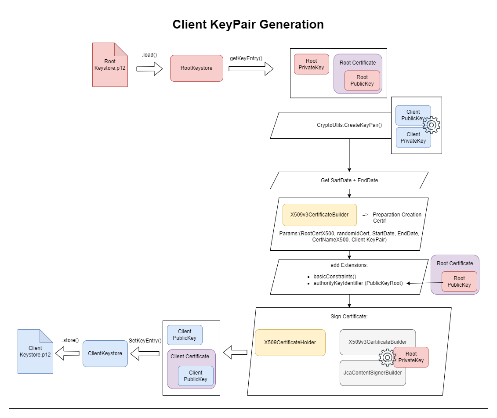

# RTI Project for 2023
- This project was created for our Java Lessons. It consist in managing a Vegetables market, client could use a Java Application or C++ Application to do online shopping (all request is send by TCP to a C++ Server). Once a command is created, employees could use a Java Application to manage payement (all request is send by TCP to a Java Server). Employees could also use a webPage to manage inventory and merchandise prices.

- It features, TCP Java/C++ connexions (with Java to C++ connexions), HTTP Java REST API (full handmade), a webPage using JS / Ajax, an Android App (Java). The whole project got a secured version with a hand made crypto version, and TLS/HTTPS version.

## Overall Project Architecture

## Data Base 
We use a small SQL database with that will provide to type of loggable user. Employees and user accounts. A user will generate Factures with a set of "sales" that represent the quantity of same type article buyed. We have created for each language an Object Model to represent these data in C++ and Java/Android.

## Achat/Purchase (Hybrid)

### Achat/Purchase Server (C++)

### Achat/Purchase Client (C++)

### Achat/Purchase Client (Java)

### MyMaraicherMobile/Purchase Client (Android)

## Payements (Java)

### Payements Protocol (Java)

### Unsecured

### Secured 

### Payements Server (Java)

### Payements Client (Java)

## Stock (Hybrid)

### StockManagement_WebServer (Java)

### StockManagement_WebPage (HTML/CSS/JS)